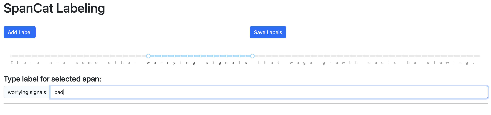
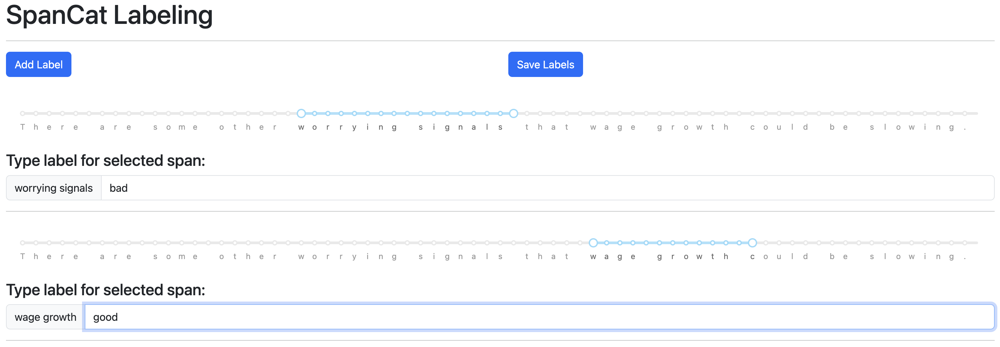

# Application to generate training set for spaCy's spancat model:
- Generates txt file that labels a sequence of tokens (spans).
- Allows for a span within a span to be labeled.
- See labeled_data.txt for an example ouput.

# Example screenshot of the app:
- Use the slider to highlight portion of text to label.
- Then type desired label.
- Save the label or add another.
  


- Example of adding another label:




# To run the app, run the following in the terminal in this project's directory:

```console 
python index.py
```
